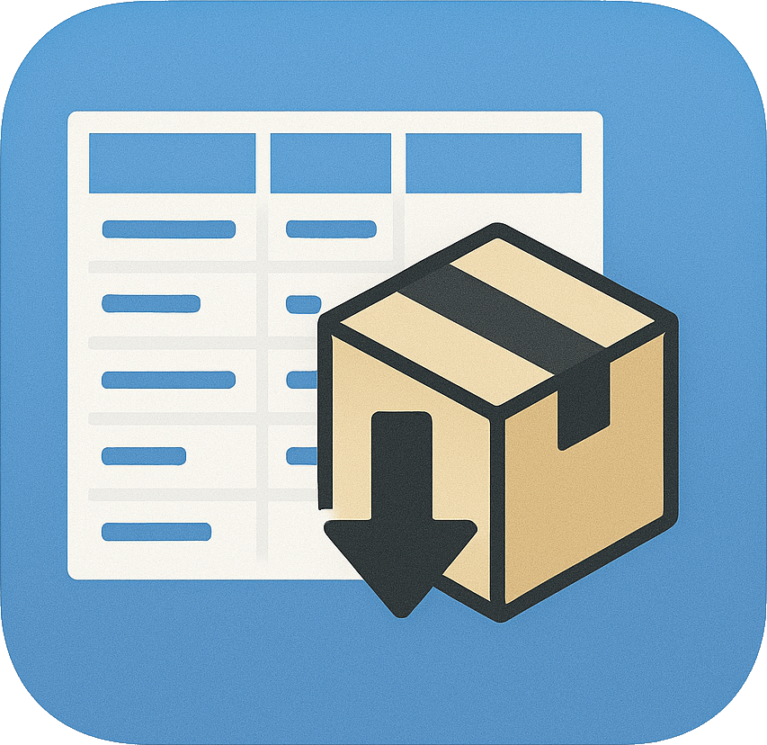
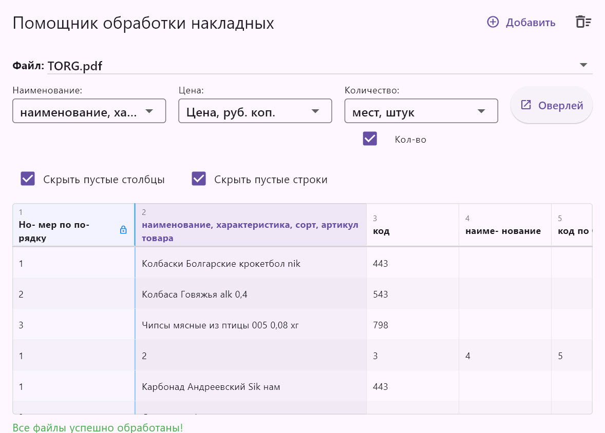
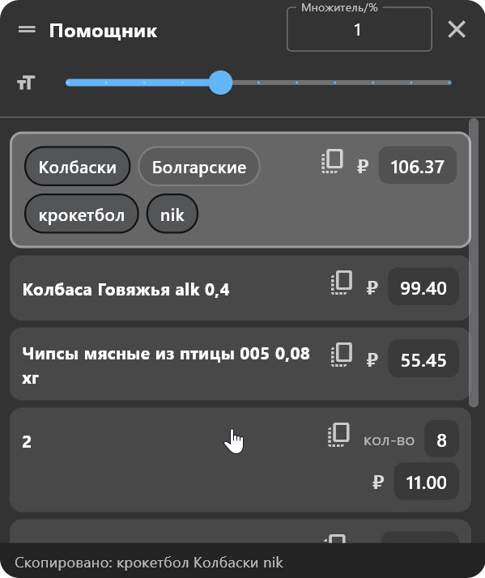

# Invoice Helper
<p align="center">
  
</p>

**Invoice Helper** — это Windows-приложение, призванное ускорить процесс ручного заполнения прихода товаров в программе 1С, используя только названия товаров из номенклатуры.

<p align="center">
  
  
</p>

## 🎯 Для пользователей

Приложение работает по простому принципу:

1.  **Передайте в приложение ваши PDF-файлы или сканы**, содержащие накладные. Программа попытается найти в них таблицы с товарами.
2.  В случае успеха, вы сможете открыть **дополнительное окно-оверлей** (поверх всех других окон) с удобным интерфейсом для копирования названий, цен и количества (опционально). В нём также можно указать наценку/НДС/... .
3.  В оверлее выберите нужный товар и **кликните на слова**, которые хотите скопировать (порядок кликов учитывается), или скопируйте название целиком.
4.  Выбранный текст попадёт в буфер обмена. Перейдите в программу 1С, кликните на поле ввода названия и нажмите **`Ctrl + V`**.

## 👨‍💻 Для разработчиков

### Известные проблемы и потенциальные места оптимизации:

* Иногда при закрытии оверлея может закрыться так же и само приложение, это случается не так часто и особых трудностей не вызывает, но проблема существует и закопана, вероятно, где то в `frontend\windows\runner\main.cpp` , `frontend\windows\runner\flutter_window.cpp` или в библиотеке `window_manager_plus_v2`.

* Сейчас при выборе и загрузке одновременно нескольких файлов обработка на стороне бекенда происходит поочерёдно - для каждого файла отдельно вызывается `parser.exe --file "path/to/file"` что немного замедляет процесс обработки, если кому то критична скорость - придётся модернизировать бекенд и немного фронт.

* Особенность бекенда: таблицы неплохо определяются при наличии текстового слоя в pdf, но со сканами и фото всё кратно хуже - при плохом качестве скана/фото таблица может не найтись или текст может распознаться плохо. Бекенд легко заменить на что то другое, буду благодарен если ваши светлые умы согут прикрутить что то более легковесное и точное (в особенности для сканов/фото).

* ...другие проблемы ?

### Архитектура и принцип работы

Если коротко, из чего состоит и как работает это приложение:

*   **Backend**: `parser.exe` — простейший Python-скрипт на базе библиотеки **Dedoc** и **Tesseract OCR** со всем необходимым окружением.
    *   Работает по принципу CLI: `parser.exe --file "path/to/file"`.
    *   Скрипт ищет таблицы, имеющие строку из последовательности ячеек `1, 2, 3...` (или с буквами). Наличие этой строки в таблице означает, что это именно та таблица, которая нам нужна - такой "якорь" я использую конкретно для свего случая (все мои таблицы имеют его), но если ваши таблицы нужно искать по другим признакам, вам придётся отредактировать код `parser.py` и собрать его самостоятельно. 

*   **Frontend (UI)**: Полностью написан на **Flutter (Dart)**.

*   **Взаимодействие**: При открытии файла(ов) Flutter-приложение для каждого из них выполняет команду `parser.exe --file "path/to/file"`. Полученные таблицы хранятся в памяти, пока приложение запущено.

### Инструкция по ручной сборке
Перед сборкой обязательно установите python 3.9/3.8 так как пакет `Dedoc` разрабатывается исключительно под эти версии. Так же стоит упомянуть что dedoc тестируется разработчиками только на Ubuntu, но на Windows, по моему опыту, тоже работает (версия 2.4).

1.  Клонируйте репозиторий:
    ```bash
    git clone https://github.com/Lorax121/invoice_helper.git
    ```

2.  Перейдите в папку проекта:
    ```bash
    cd invoice_project/frontend
    ```

3.  Выполните очистку и загрузку зависимостей:
    ```bash
    flutter clean
    flutter pub get
    ```

4.  Соберите Windows-приложение:
    ```bash
    flutter build windows
    ```

5.  Скачайте готовый или соберите самостоятельно `parser.exe`.

Для самостоятельной сборки parser.exe:
* ```bash
    cd invoice_project/backend
    py -3.9 -m venv venv
    ```

* ```bash
    venv\Scripts\activate
    ```
* ```bash
    pip install -r requirements.txt
    ```
* ```bash
    pyinstaller parser.spec
    ```

    Готово, файл `parser.exe` ищем по пути `backend\dist`.
    
6.  Поместите `parser.exe` в папку `backend`.

7.  Скачайте и установите **Tesseract-OCR** (например, [отсюда](https://docs.coro.net/featured/agent/install-tesseract-windows/)). Корневую папку `Tesseract-OCR` переименуйте в `tesseract` и поместите её также в папку `backend`.

8. Перенесите ранее полученную папку `backend` в папку `frontend\build\windows\runner\Release` (где находится исполняемый файл `invoice_helper.exe`).

9. Готово! Запускаем `invoice_helper.exe`.

## 🙌 Для всех и немного о проекте

Приложение от А до Я разрабатывалось с активным использованием AI-программистов. Сам я не являюсь специалистом в этой области, соответственно, своей головой я ничего особо исправить/оптимизировать не смогу (сделал то, что было в моих силах).

Если вы обнаружите критические проблемы или вам нужны какие-то минимальные правки для удобства — пишите, постараюсь помочь. Однако я не готов тратить много времени на дальнейшее обновление и оптимизацию, так как мои текущие потребности приложение полностью покрывает.

В связи с этим **проект открыт к помощи разработчиков-энтузиастов!**
